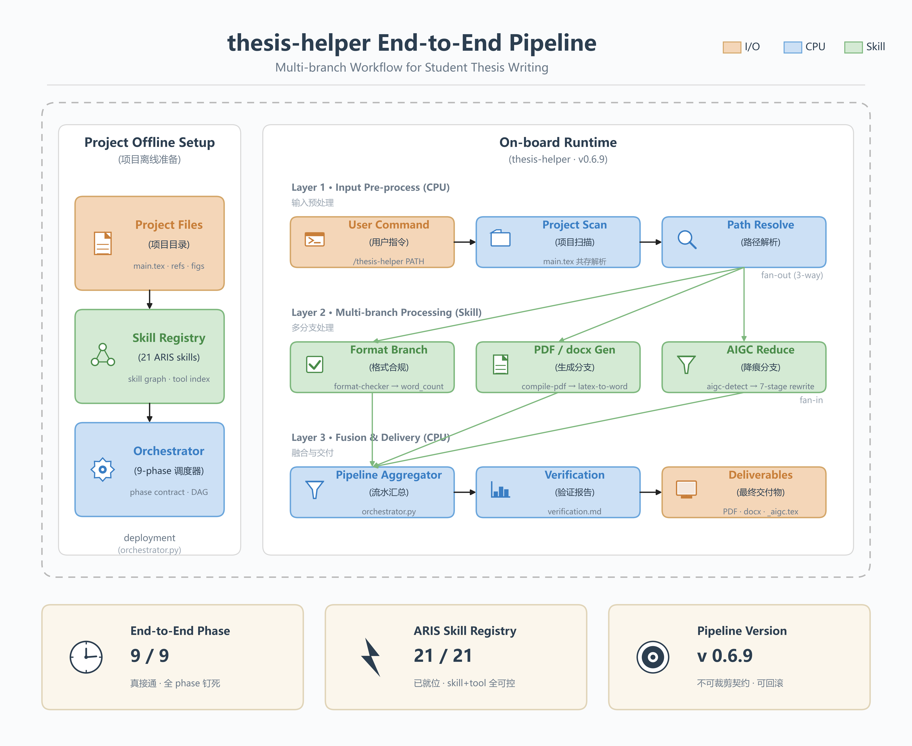
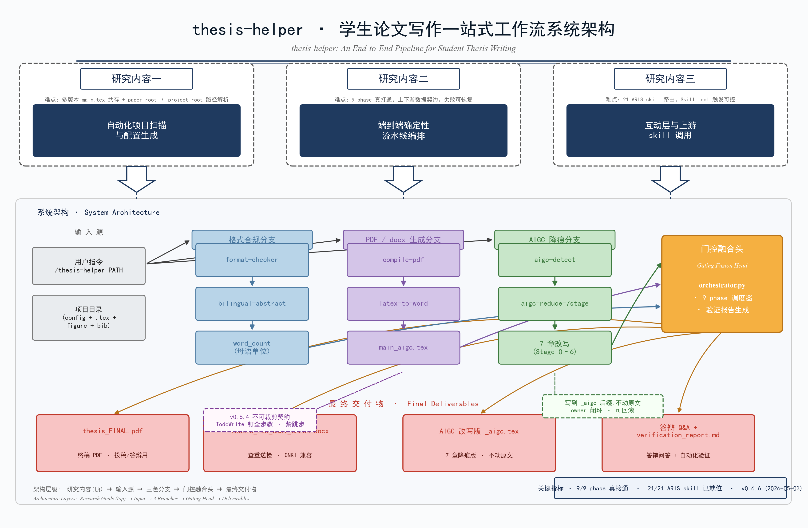
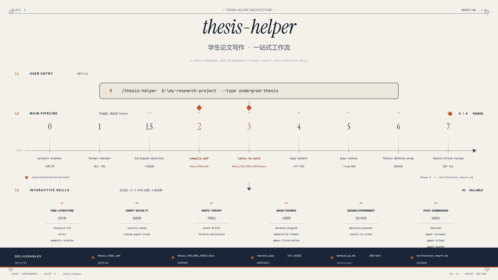
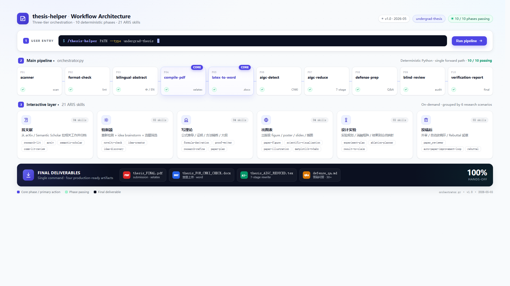
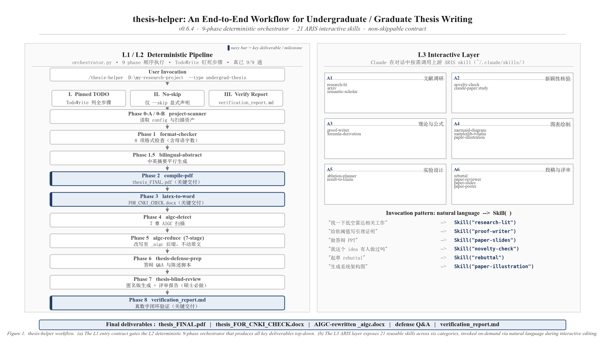

# thesis-helper · 工作流图五种风格选项

> v0.6.10 用 canvas-design / frontend-design / matplotlib × 3 并行渲染了 5 张架构图，按汇报场景挑选。

## 🅴 Variant E · 干净三层 pipeline 图（推荐 · 当前最佳）

- **风格**：现代企业架构图（参考用户提供的 reference 设计）
- **配色**：严格 3 色编码 —— 🟧 I/O 橙 + 🔵 CPU 蓝 + 🟢 Skill 绿（语义化区分）
- **结构**：左 panel "Project Offline Setup" + 右 panel "On-board Runtime"（3 dashed 子层）+ 底部 3 张 KPI 卡
- **加分**：所有图标用 matplotlib primitives 自绘（不依赖字体 glyph，零方块），命名严谨（Pipeline Aggregator 不再误用"门控融合"）
- **文件**：`variant-E-clean.png` (1.1 MB · 6614×5413 · 520 DPI)

## 🅳 Variant D · 中国学术系统架构图风

- **风格**：国家基金/毕业论文章节扉页常见的"系统架构图"范式
- **配色**：深海军蓝 #1f3a5f（研究内容三联块）+ pastel 蓝/紫/绿三色分支 + 橙色门控融合头 + 粉色 4 交付物
- **结构**：顶部三块"研究内容一/二/三" + 大白箭头 → 底部输入源 → 三色平行分支 → 门控融合 → 4 个最终交付物
- **加分**：dashed callout 注解框（v0.6.4 契约 + AIGC 闭环）+ 右下角性能指标条
- **适合**：本科/硕士毕设答辩、国基金申请、组会汇报、给中国老师看
- **文件**：`variant-D-academic-cn.png` (555 KB · 3436×2246 · 220 DPI)

## 🅰️ Variant A · 海报版（古典杂志/制图年鉴风）

- **风格**：PLATE I · QUEST CARTOGRAPHY 古典制图年鉴
- **配色**：米黄底 + 深红 + 海军蓝 + 黑白 serif
- **适合**：学术海报、毕设成果展、有"匠气"的汇报
- **文件**：`variant-A-canvas.png` (362 KB · 1920×1080)

## 🅱️ Variant B · Dashboard 版（Vercel/Linear/Stripe 风）

- **风格**：现代 SaaS 控制台
- **配色**：靛蓝 #4F46E5 + 中性灰 + 软阴影
- **排版**：顶部命令栏 + 横向 10 卡片流 + 底部黑色交付物 band
- **适合**：工程汇报、行业大会、给老板/投资人看
- **文件**：`variant-B-frontend.png` (202 KB · 1920×1080) + `variant-B-frontend.html`（可改色）

## 🅲 Variant C · 学术 paper figure 版（顶会论文风）

- **风格**：顶会论文 architecture diagram 严谨黑白
- **配色**：纯黑白 + 深海军蓝 #1f3a5f 标 4 处关键里程碑
- **排版**：左 L1/L2 纵向流 + 右 L3 网格 + 底部 Figure 1 caption
- **适合**：答辩 PPT、毕业论文插图、给评审看
- **文件**：`variant-C-academic.png` (418 KB) + `variant-C-academic.svg`（可放大无损）

## 选用建议

| 汇报场景 | 推荐 |
|---------|------|
| 给老师汇报项目进展 | **C** 严谨可信 |
| 答辩 PPT 第一页 | **C** 或 **B** |
| 给同学/学弟妹推广 | **B** 视觉冲击强 |
| 学术海报 / 比赛 | **A** 独特设计感 |
| 投稿论文配图 | **C** 唯一适合直接放进 .tex |

## 重新渲染

- A: `python variant-A-render.py`
- B: 在浏览器打开 `variant-B-frontend.html` 改 CSS，再用 `chrome --headless --window-size=1920,1080 --screenshot=variant-B-frontend.png variant-B-frontend.html` 重导
- C: `python draw_workflow_v2.py`
