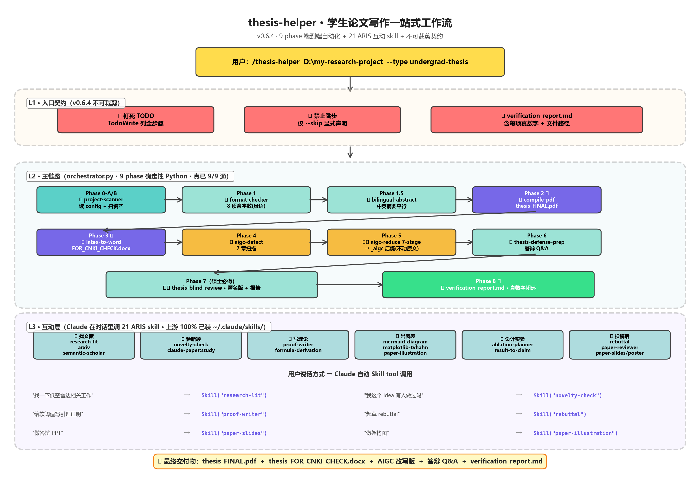

# SKILL — Claude Code 技能集合

> daidaoayue 维护的 Claude Code skill 大仓库，按使用场景分类组织。所有 skill 均可直接放入 `~/.claude/skills/` 目录加载使用。

## 📂 当前收纳

### 📝 Paper_Writing（论文写作类）




| Skill 包 | 入口 | 介绍 |
|---------|------|------|
| [`thesis-helper`](Paper_Writing/thesis-helper/) ⭐ | `/thesis-helper PATH` | **顶层一站式入口**（v0.6.3+）。本科/硕士/博士毕设、IEEE/Elsevier 期刊、ACM 会议——给项目目录就自动路由：扫资产 → 格式合规（含字数按学校母语单位 9 类规范）→ 中英摘要平行检查 → PDF/docx 双交付 → AIGC 7-stage 真改写（写到 _aigc 后缀，不动原文）→ 答辩 Q&A → 盲审版。底层调 `aigc-reduce-skills` + `PaperWriting` + 17 个 ARIS skill。**接到指令后第一时间钉死 TODO 流水线契约，禁止"我觉得不需要"地跳步骤** |
| [`aigc-reduce-skills`](Paper_Writing/aigc-reduce-skills/) | `/aigc降低` | 全自动学术降 AIGC 率流水线 v4，**模型驱动 + 7 段串行**（去结构化 → 词汇 → 节奏 → 衔接 → 克制 → 困惑度+思维痕迹 → 引用注入），自动调用 NeurIPS 2023 检测模型预扫描，按 `ai_prob` 排序处理，处理后 before/after delta 验证 |
| [`PaperWriting`](Paper_Writing/PaperWriting/) | `/paper-writing` 等 | 学术论文写作 skill 集合（来源 [skills-codex](https://github.com/skills-codex) 生态 + 独立 `paper_reviewer`）：从实验结果到投稿就绪 PDF 的全流程 — `paper-plan` / `paper-figure` / `paper-write` / `paper-compile` / `paper-illustration` / `paper-slides` / `paper-poster` / `paper-writing` / `paper_reviewer` |

> 推荐入口顺序：**真懒 → `/thesis-helper`（一句话起飞）；想精控某段 → 直接调 `/paper-writing` 或 `/aigc降低`**。

#### 🚦 thesis-helper · 不可裁剪契约（v0.6.3 新增）

接到 `/thesis-helper PATH` 第一时间，agent **必须** 用 TodoWrite 工具把对应论文类型的
pipeline 全步骤写成 TODO 列表，逐项打钩。**禁止跳步**——之前真实事故：agent 凭"我觉得
不需要"漏跑 word_count、format-check、AIGC 扫描，复盘后落本契约。完整规则见
[`Paper_Writing/thesis-helper/SKILL.md`](Paper_Writing/thesis-helper/SKILL.md) 的
"🚦 不可裁剪契约" 章节。

#### 📊 字数门槛 · 9 类论文规范母语单位（v0.6.3）

| 规范 | 门槛 | 单位 | | 规范 | 门槛 | 单位 |
|------|------|------|---|------|------|------|
| buaa_undergrad | 30k-100k | 中文字符 | | journal-ieee | 4k-12k | 英文单词 |
| buaa_master | 50k-150k | 中文字符 | | journal-elsevier | 5k-15k | 英文单词 |
| tsinghua_undergrad | 30k-100k | 中文字符 | | conference-acm | 3k-9k | 英文单词 |
| tsinghua_master | 50k-150k | 中文字符 | | generic | 5k-100k | auto |
| phd-thesis | 80k-200k | 中文字符 | | | | |

> 中文论文按"中文字符数"比，英文论文按"英文单词数"比——按学校规范母语去比，不是字+词混算。

> 后续会逐步收纳更多写作类 skill：投稿合规检查、rebuttal 协作 …

---

## 🚀 快速安装

### 安装 `thesis-helper`（一站式论文工作流，**推荐入口**）

```bash
# 完整 clone 后做目录 junction（Windows）或 symlink（Linux/Mac），保仓库与本地同步
git clone https://github.com/daidaoayue/SKILL.git ~/SKILL

# Windows（PowerShell，无需管理员）：
New-Item -ItemType Junction -Path "$env:USERPROFILE\.claude\skills\thesis-helper" -Target "$env:USERPROFILE\SKILL\Paper_Writing\thesis-helper"

# Linux / macOS：
ln -s ~/SKILL/Paper_Writing/thesis-helper ~/.claude/skills/thesis-helper
```

使用：

```text
/thesis-helper D:\my-research-project
/thesis-helper D:\my-research-project --type undergrad-thesis --venue 北航
/thesis-helper D:\my-research-project --type journal --venue IEEE_JOURNAL
```

接到指令后 agent 自动：扫资产 → 钉 TODO 流水线（不可裁剪契约）→ 逐项跑 → 输出 PDF + docx + AIGC 改写 + 答辩 Q&A + 验证报告。

### 安装 `aigc-reduce-skills`（AIGC 降低 v4）

```bash
# 完整 clone（最简单）
git clone https://github.com/daidaoayue/SKILL.git ~/SKILL
cp -r ~/SKILL/Paper_Writing/aigc-reduce-skills/aigc-reduce* ~/.claude/skills/
cp -r ~/SKILL/Paper_Writing/aigc-reduce-skills/aigc-scan ~/.claude/skills/

# 安装本地检测模型依赖（首次运行 detect_aigc.py 自动下载 ~500MB 模型）
pip install -r ~/SKILL/Paper_Writing/aigc-reduce-skills/detect_aigc/requirements.txt
```

使用：`/aigc降低 path/to/paper.tex` — 自动跑完 7 段流水线 + before/after delta 验证。

### 安装 `PaperWriting`（论文写作全流程）

```bash
# 完整 clone
git clone https://github.com/daidaoayue/SKILL.git ~/SKILL
cp -r ~/SKILL/Paper_Writing/PaperWriting/paper-* ~/.claude/skills/
cp -r ~/SKILL/Paper_Writing/PaperWriting/paper_reviewer ~/.claude/skills/
```

> ⚠️ `paper-plan` / `paper-write` / `paper-figure` 等核心 pipeline 技能依赖 [Codex MCP](https://github.com/skills-codex) 插件（用 `claude mcp add codex` 安装），`paper_reviewer` 可独立使用。

使用：`/paper-writing path/to/NARRATIVE_REPORT.md` — 一键串联 `plan → figure → write → compile → review`。

### Sparse checkout（只下载某一个子目录，省流量）

```bash
mkdir -p ~/.claude/skills && cd ~/.claude/skills
git clone --depth 1 --filter=blob:none --sparse https://github.com/daidaoayue/SKILL.git _tmp
cd _tmp && git sparse-checkout set Paper_Writing/aigc-reduce-skills
mv Paper_Writing/aigc-reduce-skills/aigc-reduce* ../
mv Paper_Writing/aigc-reduce-skills/aigc-scan ../
cd .. && rm -rf _tmp
```

具体使用文档详见每个 skill 包目录下的 `README.md`。

---

## 🗂️ 目录约定

```
SKILL/                                    ← 大仓库根目录
├── README.md                             ← 本文件（导航）
├── LICENSE                               ← MIT
├── Paper_Writing/                        ← 论文写作类
│   ├── aigc-reduce-skills/               ← AIGC 率降低流水线 v4（模型驱动）
│   │   ├── README.md
│   │   ├── aigc-reduce/                  ← 总入口（/aigc降低，7 段流水线编排器）
│   │   ├── aigc-reduce-destructure/      ← Stage 0 去结构化（致谢专项 + 整齐编号打散）
│   │   ├── aigc-reduce-vocab/            ← Stage 1 词汇精炼
│   │   ├── aigc-reduce-rhythm/           ← Stage 2 节奏 + 段长不齐
│   │   ├── aigc-reduce-cohesion/         ← Stage 3 逻辑衔接
│   │   ├── aigc-reduce-hedging/          ← Stage 4 克制（降级使用）
│   │   ├── aigc-reduce-perplexity/       ← Stage 5 困惑度 + 思维痕迹注入
│   │   ├── aigc-reduce-cite-inject/      ← Stage 6 引用注入
│   │   ├── aigc-scan/                    ← 独立预扫描诊断工具（v4 新增）
│   │   └── detect_aigc/                  ← 本地 NeurIPS 2023 检测模型（v3 含 section-split + compare）
│   └── PaperWriting/                     ← 论文写作 skill 集合（v1 新增）
│       ├── README.md                     ← 完整安装 + 使用说明 + Codex MCP 依赖说明
│       ├── paper-plan/                   ← 大纲生成（Claims-Evidence 矩阵）
│       ├── paper-figure/                 ← 出版级图表自动生成
│       ├── paper-write/                  ← 逐节 LaTeX 生成（含 IEEE/NeurIPS/ICLR 模板）
│       ├── paper-compile/                ← latexmk 编译 + 错误自修
│       ├── paper-illustration/           ← 架构图/流程图生成
│       ├── paper-slides/                 ← Beamer 幻灯片 + 演讲稿
│       ├── paper-poster/                 ← 学术海报（A0 竖版）
│       ├── paper-writing/                ← 全流程编排器（plan→figure→write→compile）
│       └── paper_reviewer/               ← 审稿人视角评审（独立，不依赖 Codex MCP）
├── （未来）Coding/                       ← 代码类
├── （未来）Research/                     ← 研究类
└── （未来）Productivity/                 ← 效率类
```

---

## 🔗 推荐组合使用

### 一句话起飞（推荐 · v0.6.3+）

```bash
/thesis-helper D:\my-research-project
```

→ thesis-helper 自动按论文类型路由完整 pipeline，端到端给你 PDF + docx + AIGC 改写 + 答辩 Q&A + 验证报告。**接到指令后 agent 第一时间钉死 TODO，逐项打钩，禁止跳步**。

### 或精控某段（写论文 → 降 AIGC → 投稿，传统三段式）

```bash
# 1. 从实验报告生成投稿就绪的 LaTeX + PDF
/paper-writing path/to/NARRATIVE_REPORT.md

# 2. 跑 AIGC 降痕（v4 自动预扫描 + 模型评分排序 + before/after delta）
/aigc降低 paper/main.tex

# 3. 导出 Word 上传 CNKI 终审
```

---

## 🤝 贡献

欢迎 Issue / PR：
- 新增 skill 包（按场景归到对应一级目录，没有的话开新目录）
- 优化现有 skill 的词表、流水线、模板
- 贡献新的 LLM 套搭配 / N-gram / CNKI 实测标红样本到 `aigc-reduce-*` 词库
- 翻译 README 到其他语种

## 📜 License

MIT — 随便用，欢迎 fork 改造。

> ⚠️ `Paper_Writing/PaperWriting/` 下除 `paper_reviewer` 外的 skills 来自 [skills-codex](https://github.com/skills-codex) 插件生态，**本仓库仅作个人备份与学习用途，不主张原创权**。如有侵权请联系删除。
