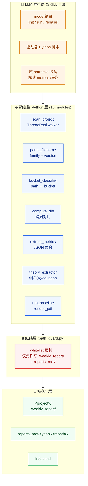
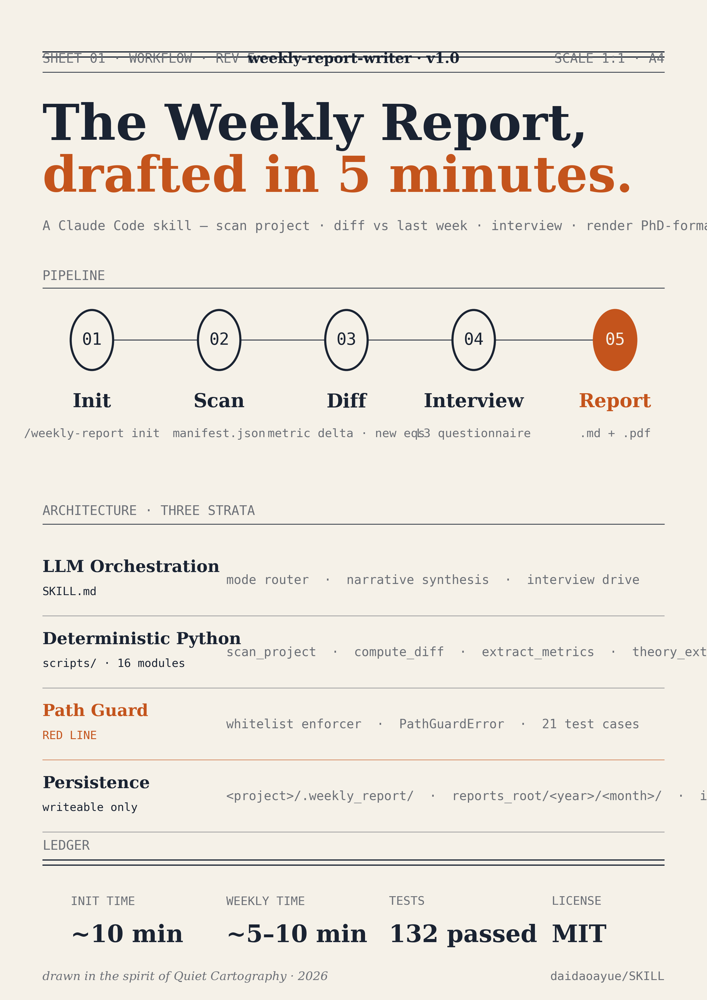
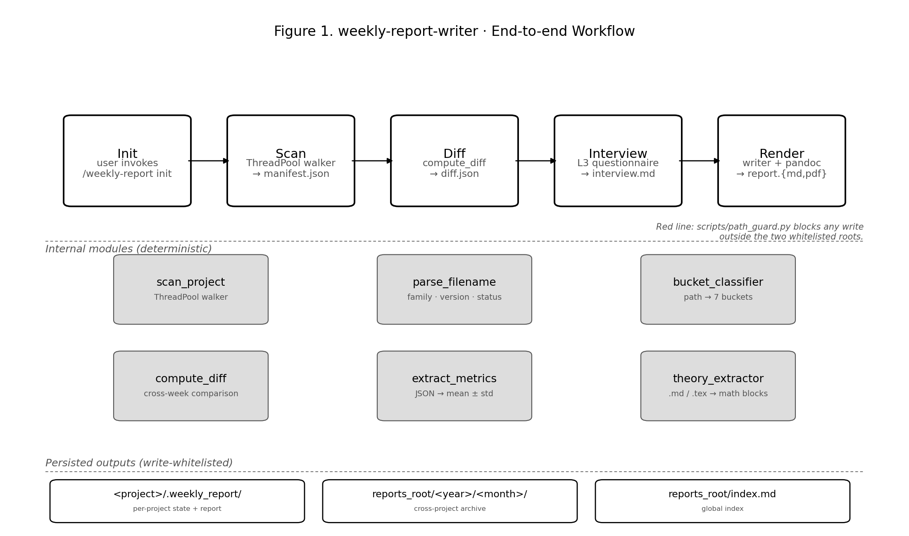

<div align="center">

# 📊 weekly-report-writer · 工作流可视化

**8 种风格变体 · 选你喜欢的挂在主 README**

</div>

---

每张图聚焦一个不同的"读者视角"，可单独看也可组合看。**前 5 张（A-E）**是 mermaid / ASCII 文本，GitHub 直接渲染；**后 3 张（F-H）**是产物文件（HTML / PNG），需要本地查看。

| 变体 | 视角 | 适合谁看 | 风格 | 产物 |
|------|------|----------|------|------|
| [A · Pipeline](#variant-a--pipeline-横向流水线) | 流程节点 | 第一次接触 skill 的人 | mermaid 横向流水线 | inline |
| [B · Layered](#variant-b--layered-三层架构) | 系统架构 | 想了解「谁负责什么」的开发者 | mermaid TB 分层 | inline |
| [C · Sequence](#variant-c--sequence-用户时序) | 用户交互时序 | 想知道「我什么时候要动手」的 PhD | mermaid sequenceDiagram | inline |
| [D · Buckets](#variant-d--buckets-bucket-辐射图) | 数据维度 | 想知道「skill 都看了什么」 | ASCII 辐射 | inline |
| [E · Red Line](#variant-e--red-line-红线安全边界) | 安全边界 | 想确认「skill 不会乱动我代码」 | ASCII 双区块 | inline |
| [F · Blueprint HTML](#variant-f--blueprint-engineering-html) | 工程蓝图 | 想要"挂到墙上能看十年"的视觉 | HTML + 衬线字体 + ember 单点强调 | `variant-F-frontend.html` |
| [G · Studio Friday Poster](#variant-g--studio-friday-poster) | 设计哲学 | 想要正式 PDF/PNG 海报（A4 印刷级） | matplotlib · paper-cream + ember 4 色 | `variant-G-poster.png` |
| [H · Academic Figure](#variant-h--academic-figure) | 论文配图 | 写论文/答辩 PPT 用 | matplotlib · 黑白灰 · landscape | `variant-H-academic.png` |

---

## Variant A · Pipeline（横向流水线）

> 5 阶段流水线，左→右，箭头标输入/输出。**最易上手的那张**。

```mermaid
flowchart LR
    A[👤 用户<br/>/weekly-report init] --> B[🔍 Scan]
    B --> C[📊 Diff vs last week]
    C --> D[💬 Interview L3]
    D --> E[✍️ Write report.md]
    E --> F[📄 Render PDF]
    F --> G[📁 Archive + Index]

    B -.manifest.json.-> B1[(file metadata<br/>version chains<br/>buckets)]
    C -.diff.json.-> C1[(version 推进<br/>metric 变化<br/>新增公式块)]
    D -.interview.md.-> D1[(用户填<br/>**请填**: 空)]
    E -.markdown.-> E1[(报告骨架<br/>+ 8 段叙述)]
    F -.pandoc + xelatex.-> F1[(.pdf 14 页<br/>宋体 + 黑体)]

    classDef step fill:#1F4E79,stroke:#fff,color:#fff
    classDef artifact fill:#F4F7FB,stroke:#1F4E79,color:#1F4E79
    class A,B,C,D,E,F,G step
    class B1,C1,D1,E1,F1 artifact
```

**关键洞察**：每一步都有持久化产物（manifest / diff / interview / md / pdf），可以单独 inspect & 重跑。

---

## Variant B · Layered（三层架构）

> 把"谁干活"分清楚：LLM 编排在上，确定性 Python 在中，磁盘产物在下。



**关键洞察**：LLM 只编排 + 写叙述，**所有数值/diff 都来自 Python**——不存在 LLM 看错指标这回事。

---

## Variant C · Sequence（用户时序）

> PhD 的视角：**我在什么时刻要动手**？只看时间轴。

```mermaid
sequenceDiagram
    actor U as 👤 PhD
    participant CC as 🧠 Claude
    participant S as 🔍 Scanner
    participant V as 📋 Vocab/Diff
    participant W as ✍️ Writer

    Note over U,W: ─── 第一次（init，~10 分钟）───
    U->>CC: /weekly-report init &lt;project&gt;
    CC->>S: 扫工程
    S-->>CC: manifest（多少 .py / .json / 公式块）
    CC->>U: 给 project.toml 草稿
    U->>CC: 改 advisor / student / domain
    CC->>V: 收集所有 metric key
    CC->>U: open metric_vocab_init.md
    Note right of U: 30 个 key × 30s ≈ 15 分钟
    U->>CC: 填好（一次性，永久保存）
    CC->>W: render_baseline
    W-->>U: 📄 baseline_report.{md,pdf}（14 页快照）

    Note over U,W: ─── 一周后（增量，~5 分钟）───
    U->>CC: /weekly-report run
    CC->>S: scan + diff vs 上周
    CC->>V: 检测有没有新 metric key
    CC->>U: open interview.md（5-9 节，仅有变动的）
    Note right of U: 填 **请填**: 空 ≈ 5-10 分钟
    U->>CC: 填好
    CC->>W: 写报告
    W-->>U: 📄 report.{md,pdf}
```

**关键洞察**：你的"亲力亲为"时间总共只有 **5-10 分钟/周**，扫描和 diff 是机器干的。

---

## Variant D · Buckets（Bucket 辐射图）

> Skill 都"看"了什么？7 个 bucket 围绕 project root。**ASCII 终端美学**。

```
                              ┌──────────────────┐
                              │    📦 code       │
                              │  .py / .cpp / .h │
                              │  version chains  │
                              └─────────┬────────┘
                                        │
       ┌──────────────────┐             │             ┌──────────────────┐
       │  📊 figures      │             │             │  📚 reading      │
       │  png / svg / pdf │◀────────┐   │   ┌────────▶│  md / pdf        │
       │  embed in report │         │   │   │         │  literature      │
       └──────────────────┘         │   │   │         └──────────────────┘
                                    │   │   │
                              ┌─────┴───┴───┴─────┐
                              │                   │
                              │   🌐 project       │
                              │     root/          │
                              │                   │
                              │  scanner 入口      │
                              │                   │
                              └─────┬───┬───┬─────┘
                                    │   │   │
       ┌──────────────────┐         │   │   │         ┌──────────────────┐
       │  📐 theory       │         │   │   │         │  📄 paper        │
       │  derivations     │◀────────┘   │   └────────▶│  .tex / .md      │
       │  $$ / \(\) / eq  │             │             │  .docx           │
       └──────────────────┘             │             └──────────────────┘
                                        │
                              ┌─────────┴────────┐
                              │ 📈 experiment    │
                              │    + 💾 ckpt     │
                              │  .json metrics   │
                              │  (filename only) │
                              └──────────────────┘

                  7 个 bucket · 全部 read-only · 只看不改
```

**关键洞察**：bucket 是 skill 用来"知道这个文件该归到哪类"的标签——你能完全 override（在 `project.toml` 里改 `roots`）。

---

## Variant E · Red Line（红线安全边界）

> "skill 会不会乱动我代码？" 这张图给你**铁律**。

```
╔══════════════════════════════════════════════════════════════╗
║                  📂 你的工程目录（任意位置）                    ║
║  ┌────────────────────────────────────────────────────────┐  ║
║  │  src/         data/         paper_writing/             │  ║
║  │   *.py         *.npy         *.tex / *.md              │  ║
║  │  output/      ckpt/         figs/                      │  ║
║  │   *.json       *.pth         *.png                     │  ║
║  └────────────────────────────────────────────────────────┘  ║
║                                                              ║
║      🚫 skill 永不写入此区域 (READ-ONLY 强制)                  ║
║      ─────────────────────────────────────                   ║
║      由 scripts/path_guard.py 拦截：                          ║
║         assert_write_allowed(target, project_root)           ║
║         任何尝试写到此区域 → PathGuardError 抛出              ║
╚══════════════════════════════════════════════════════════════╝

                              │
                  scan + diff │ extract（read-only）
                              ▼

╔══════════════════════════════════════════════════════════════╗
║  ✅ 唯一可写区域 1：&lt;project&gt;/.weekly_report/                  ║
║  ┌────────────────────────────────────────────────────────┐  ║
║  │  &lt;year&gt;/&lt;month&gt;/&lt;date&gt;_baseline_report.{md,pdf}        │  ║
║  │  &lt;year&gt;/&lt;month&gt;/&lt;date&gt;_W&lt;n&gt;_report.{md,pdf}             │  ║
║  │  tex/&lt;year&gt;/&lt;month&gt;/&lt;day&gt;/&lt;date&gt;_*.{tex,aux,log,out}    │  ║
║  │  project.toml      ← 用户配置                          │  ║
║  │  metric_vocab.json ← 指标词典                          │  ║
║  │  baseline/manifest.json ← 扫描状态（init 阶段写）       │  ║
║  └────────────────────────────────────────────────────────┘  ║
╠══════════════════════════════════════════════════════════════╣
║  ✅ 唯一可写区域 2：reports_root（你定，默认 D:/code/reports/） ║
║  ┌────────────────────────────────────────────────────────┐  ║
║  │  index.md                                              │  ║
║  │  &lt;year&gt;/&lt;month&gt;/&lt;date&gt;_baseline_&lt;short&gt;.{md,pdf}       │  ║
║  │  &lt;year&gt;/&lt;month&gt;/&lt;date&gt;_W&lt;n&gt;_&lt;short&gt;.{md,pdf}          │  ║
║  │  tex/&lt;year&gt;/&lt;month&gt;/&lt;day&gt;/&lt;date&gt;_*.tex                 │  ║
║  └────────────────────────────────────────────────────────┘  ║
╚══════════════════════════════════════════════════════════════╝

                  红线规则在 scripts/path_guard.py
                  21 个测试用例守护，无 bypass 口
```

**关键洞察**：红线靠 `path_guard.py` 程序化强制，不是靠 LLM 自律——任何越界写入会**直接抛 `PathGuardError`** 阻断流程。

---

## Variant F · Blueprint Engineering (HTML)

> 工程蓝图美学：paper-cream 底色、衬线 + 等宽双语字体、ember 色单点强调 deliverable。**像挂在研究所走廊里能看十年的那种图**。

**产物**：`variant-F-frontend.html`（独立 HTML 文件，浏览器直接打开，无外部依赖除 Google Fonts）

**预览方式**：
```
# Windows
start docs/diagrams/variant-F-frontend.html

# 或直接双击文件
```

**设计要点**（应用 frontend-design skill 原则）：
- Source Serif 4 标题 + JetBrains Mono 等宽标签（避免 Inter / Arial 这类通用字）
- 4 色调色板：ink #1A2332 / pencil #6B6F76 / ember #C4541C / paper #F5F1E8
- 三段式：流水线（5 stage 圆圈）→ 三层架构（layered）→ 底部 ledger（4 个关键数）
- ember 仅用在 deliverable（stage 05 + Path Guard 边框 + 强调标题尾）
- 双横线（top + bottom）模仿工程图签的 sheet header

---

## Variant G · Studio Friday Poster

> A4 印刷级海报。设计哲学叫 **Quiet Cartography**（详见 `variant-G-philosophy.md`），灵感来自实验室 Friday evening——chaos 沉淀成形状的那个时刻。

**产物**：`variant-G-poster.png`（A4 portrait, 300 dpi · ~380 KB）+ `variant-G-render.py` 重渲源码

**预览**：



**重渲方法**（如改了内容）：
```bash
cd docs/diagrams && python variant-G-render.py
```

**设计要点**（应用 canvas-design skill 原则）：
- 四色配置：paper #F5F1E8 + ink #1A2332 + pencil #6B6F76 + ember #C4541C（仅用在 deliverable + ledger 关键数）
- 顶部双线 sheet header（SHEET 01 · WORKFLOW · REV E）
- 主标题大字 + ember 单句强调："The Weekly Report, **drafted in 5 minutes.**"
- 三段式：Pipeline / Architecture / Ledger，每段间 0.6 pt 细线分隔
- 底部签名行 italic："drawn in the spirit of Quiet Cartography · 2026"
- 严格无：渐变 / 阴影 / 装饰图标 / 鲜艳填色

---

## Variant H · Academic Figure

> 论文配图风格。Landscape，黑白灰三色，sans-serif 字体，可直接放进 IEEE / ACM 双栏论文做 Figure 1。

**产物**：`variant-H-academic.png`（landscape 11×6.5 inch, 200 dpi · ~170 KB）+ `variant-H-academic.py`

**预览**：



**重渲方法**：
```bash
cd docs/diagrams && python variant-H-academic.py
```

**设计要点**：
- 黑白灰三色（black / gray #555 / light #DDD）
- 顶部 5 步流水线（box + arrow），节点带描述副标题
- 中部 6 个核心 deterministic module（2 行 × 3 列）
- 底部 3 个 persisted output box
- 右侧 italic 小字 caption 提及 path_guard.py 红线
- 适合放在论文 / 答辩 PPT，黑白打印不掉效果

---

## 怎么选

| 用途 | 推荐 | 理由 |
|------|------|------|
| 主 README 的 hero 图 | **A · Pipeline** | 第一眼明白干啥 |
| GitHub 仓库 social preview | **G · Poster** | 视觉冲击 + 印刷级 |
| 写架构文档 | **B · Layered** | 三层职责清楚 |
| 跟师弟师妹科普 | **C · Sequence** | "你只需 5 分钟" |
| 数据 / bucket 视角 | **D · Buckets** | 7 桶围绕 root |
| 安全合规审计 | **E · Red Line** | 红线一目了然 |
| 工程蓝图 / 网站 hero | **F · Blueprint HTML** | 交互 + 衬线高级感 |
| 论文 / 答辩配图 | **H · Academic** | 黑白可打印 |

**组合策略**：
- README 顶部 hero 用 **G · Poster**（PNG），下面接 **A · Pipeline**（细节）
- 论文配图用 **H · Academic**，附录用 **B · Layered**
- 主页交互演示用 **F · Blueprint HTML**

---

## 文件清单

```
docs/diagrams/
├── README.md                    ← 本文件（A-E 内嵌 + F-H 引用）
├── variant-F-frontend.html      ← F · 浏览器打开
├── variant-G-philosophy.md      ← G · 设计哲学（Quiet Cartography）
├── variant-G-render.py          ← G · matplotlib 渲染脚本
├── variant-G-poster.png         ← G · A4 海报产物
├── variant-H-academic.py        ← H · matplotlib 渲染脚本
└── variant-H-academic.png       ← H · landscape 论文配图产物
```
